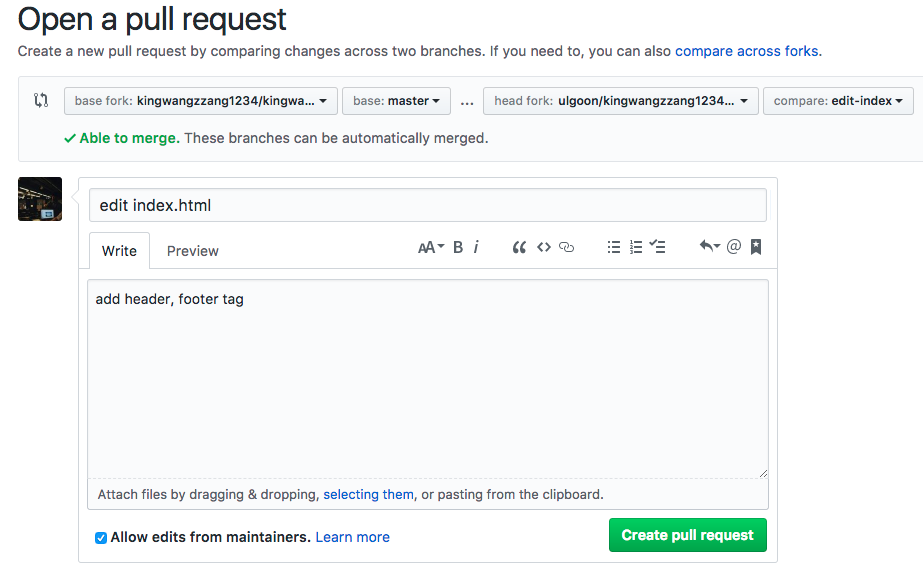
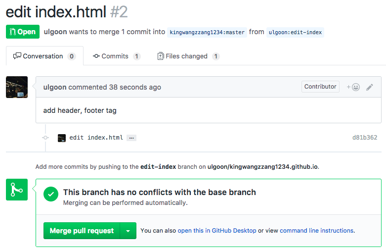
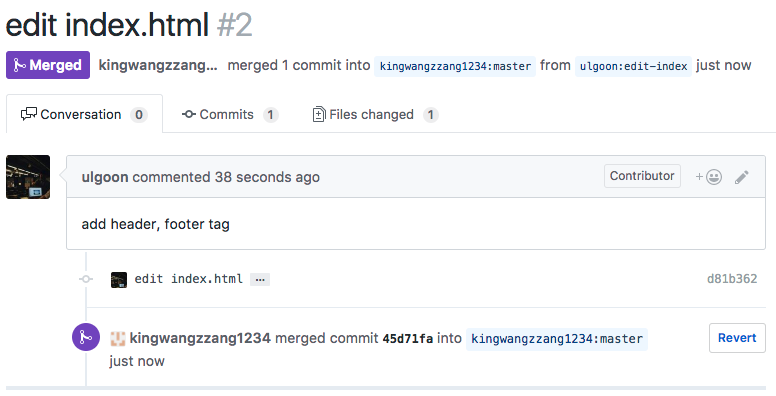

# Fastcampus
## Computer Science Extension School
### Python Basic_Day8

---
<!--
page_number: true
$size: A4
footer : fastcampus Computer Science Extension School, Wooyoung Choi, 2018
-->

## Mini Project
`recycle_bin = [1,2, "Fastcampus", [], 5,4, 5.6, "패스트캠퍼스"]`
위 리스트의 요소 중 정수만 제곱하여 출력하기

map, filter, lambda를 모두 사용

> Hint: isinstance(1, int)
---
### sign up github
https://github.com/


**important!!**
- 가입할 `email`과 `username`은 멋지게
- private repo를 원한다면 $7/month

---
## Set configuration
terminal
```shell
$ git config --global user.name "{{username}}"
$ git config --global user.email "{{github email address}}"
$ git config --list
```

---
## My First Repo
Let's make your first repo with github

---
## My First Repo
`$ git init`
`$ git add .`
`$ git commit -m "some commit"`

After create new repo through github,

`$ git remote add origin https://github.com/{{username}}/{{repo}}.git`
`$ git push origin master`


---
## What is branch?

---
## What is branch?


---
## What is branch?
분기점을 생성하고 독립적으로 코드를 변경할 수 있도록 도와주는 모델

ex)

master branch
```python
print('hello world!')
```

another branch
```python
for i in range(1,10):
    print('hello world for the %s times!' % i)
```


---
## Branch

Show available local branch
`$ git branch`

Show available remote branch
`$ git branch -r`

Show available All branch
`$ git branch -a`

---
## Branch


Create branch
`$ git branch stem`

Checkout branch
`$ git checkout stem`

Create & Checkout branch
`$ git checkout -b new-stem`

make changes inside readme.md
`$ git commit -a -m 'edit readme.md'`
`$ git checkout master`

merge branch
`$ git merge stem`

---
## Branch

delete branch
`$ git branch -D stem`

push with specified remote branch
`$ git push origin stem`

see the difference between two branches
`$ git diff master stem`

---
## git flow strategy


---
## use git flow easily!
[Link](https://danielkummer.github.io/git-flow-cheatsheet/index.ko_KR.html)


---
## Collaborate with your Co-worker

---
## Method 1: Collaboration
Add Collaborator


---
## Collaboration
Add, Commit and Push like you own it. 

---
## Method 2: Fork and Merge


---
## Fork and Merge


---
## Fork and Merge


---
## Fork and Merge
`$ git clone https://github.com/username/forked-repo.git`


---
## Fork and Merge


`$ git branch -a`
`$ git checkout -b new-feature`

---
## Fork and Merge

Make some change

`$ git add file`
`$ git commit -m "commit message"`
`$ git push origin new-feature`

---
## Fork and Merge


---
## Fork and Merge


---
## Fork and Merge


---
## Fork and Merge


---
## Fork and Merge


---
## Fork and Merge


---
## Fork and Merge



<link href="https://fonts.googleapis.com/css?family=Nanum+Gothic:400,800" rel="stylesheet">
<link rel='stylesheet' href='//cdn.jsdelivr.net/npm/hack-font@3.3.0/build/web/hack-subset.css'>

<style>
h1,h2,h3,h4,h5,h6,
p,li, dd {
font-family: 'Nanum Gothic', Gothic;
}
span, pre {
font-family: Hack, monospace;
}
</style>